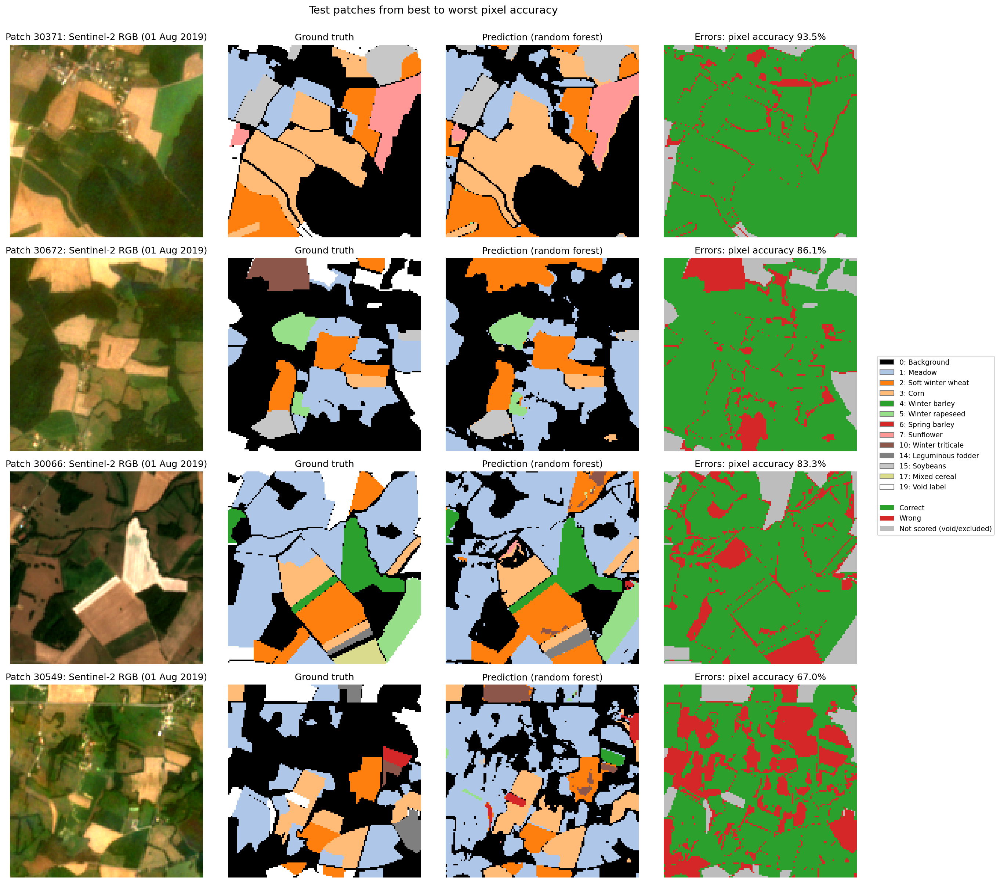

# Crop Type Classification with Multi-Temporal Sentinel-2 (PASTIS subset)

**Name:** Nitin Sharma\
**Email:** nitin18geo@gmail.com\
**Submitted for:** Solafune, Geo Data Scientist assignment

A reproducible workflow for pixel-wise crop type classification from a full season of Sentinel-2 imagery, built for the Solafune Geo Data Scientist assignment. It covers data loading, exploratory analysis, a spatially leakage-free split, feature engineering, training of a Random Forest and a LightGBM model, full-patch evaluation and visualisation of outputs.

**Results at a glance** (final model: Random Forest, spatially separate test set, all pixels):

| Overall accuracy | Weighted F1 | Macro F1 | mIoU | mIoU (crops only) |
|---|---|---|---|---|
| 0.843 | 0.834 | 0.501 | 0.441 | 0.423 |

The five main field crops reach F1 above 0.9; rare and spectrally similar classes are the main weakness. See **[report.md](report.md)** for the full analysis and **[DECISIONS.md](DECISIONS.md)** for a log of key decisions.



---

## Repository structure

```
.
├── README.md                    # this file
├── report.md                    # approach, results, analysis and next steps
├── DECISIONS.md                 # log of key decisions and their reasons
├── requirements.txt             # Python dependencies (pinned)
├── run_all.sh                   # runs the full pipeline in order
├── configs/
│   └── config.yaml              # all paths, settings and hyperparameters
├── notebooks/
│   └── exploration_and_training.ipynb   # end-to-end walkthrough with commentary
├── src/
│   ├── data_loading.py          # read S2 arrays, labels and metadata; dataset inspection
│   ├── eda.py                   # EDA statistics and figures (also colour map and RGB helpers)
│   ├── train_test_split.py      # fold-based split, class coverage check, split files
│   ├── preprocessing.py         # reflectance scaling, cloudy dates, indices, features, sampling
│   ├── train.py                 # Random Forest and LightGBM training
│   ├── evaluate.py              # full-patch evaluation, metrics, confusion matrices, predictions
│   └── visualization.py         # output figures: predictions, errors, confusion, importance
├── outputs/
│   ├── figures/                 # all EDA and result figures
│   ├── metrics/                 # CSV/JSON tables: class stats, scores, confusions, importance
│   ├── predictions/             # predicted label maps for test patches (.npy, PASTIS class IDs)
│   └── splits/                  # train_ids.txt, val_ids.txt, test_ids.txt
├── data/                        # dataset goes here (not committed)
└── models/                      # trained models are saved here (not committed)
```

## Dataset

The data is a 102-patch subset of **PASTIS** ([pastis-benchmark](https://github.com/VSainteuf/pastis-benchmark)): Sentinel-2 time series from tile T31TFM in eastern France, 46 acquisitions from September 2018 to October 2019, with a 20-class crop label scheme.

The data is **not included** in this repository. Place it in `data/` with this layout:

```
data/
├── DATA_S2/
│   ├── S2_30003.npy          # (46, 10, 128, 128) int16, bands B2 B3 B4 B5 B6 B7 B8 B8A B11 B12
│   └── ...
├── ANNOTATIONS/
│   ├── TARGET_30003.npy      # (1, 128, 128) uint8, class IDs 0-19
│   └── ...
└── metadata.geojson          # patch footprints (EPSG:2154), dates, folds
```

Paths can be changed in `configs/config.yaml`.

## Environment setup

Tested on macOS (Apple Silicon, MacBook Air) with **Python 3.9**, CPU only. No GPU is needed.

```bash
git clone https://github.com/nitin18geo/solafune-cropclassification-nitinSharma.git
cd solafune-cropclassification-nitinSharma
python3 -m venv .venv
source .venv/bin/activate          # Windows: .venv\Scripts\activate
pip install --upgrade pip
pip install -r requirements.txt
```

**macOS only:** LightGBM needs the OpenMP runtime. Install it with [Homebrew](https://brew.sh) before training:

```bash
brew install libomp
```

Without it, importing LightGBM fails with `Library not loaded: @rpath/libomp.dylib`.

## How to run

Run all commands **from the repository root** as modules (`python -m src.<name>`), so that imports between `src/` files work. Running a file directly (`python src/train.py`, or the editor's Run button) fails with `No module named 'src'`.

**Full pipeline in one command:**

```bash
bash run_all.sh
```

**Or step by step:**

| Step | Command | Outputs | Time* |
|---|---|---|---|
| 1. Inspect data | `python -m src.data_loading` | `outputs/metrics/patch_summary.csv` | seconds |
| 2. Exploratory analysis | `python -m src.eda` | EDA figures and tables | < 1 min |
| 3. Split | `python -m src.train_test_split --compare` | `outputs/splits/*.txt`, coverage tables | seconds |
| 4. Preprocessing | `python -m src.preprocessing` | `data/processed/*.npz`, `preprocessing_info.json` | < 1 min |
| 5. Training | `python -m src.train` | `models/*.joblib`, `training_summary.json`, importance tables | ~1 min |
| 6. Evaluation | `python -m src.evaluate` | metrics, confusion matrices, test predictions | < 1 min |
| 7. Output figures | `python -m src.visualization` | result figures | < 1 min |

\*On a MacBook Air (Apple Silicon, CPU). Every command accepts `--config path/to/config.yaml` (default `configs/config.yaml`). `src.train` and `src.evaluate` also accept `--models random_forest` or `--models lightgbm`.

The notebook `notebooks/exploration_and_training.ipynb` runs the same steps with commentary. Select the `.venv` kernel and use **Run All**.

### Reproducing the main results

All randomness is seeded (`seed: 42` in the config): pixel sampling, the Random Forest and LightGBM. Running `bash run_all.sh` on the same data reproduces the split files, metrics and figures in `outputs/`. The Random Forest results are deterministic; LightGBM uses multithreading, so its scores may differ in the third decimal place between machines.

### Trained models

Models are **not committed** (the Random Forest is about 48 MB). They are regenerated in about a minute by `python -m src.train` and saved to `models/random_forest.joblib` and `models/lightgbm.joblib`. Load with:

```python
import joblib
model = joblib.load("models/random_forest.joblib")
```

Inputs must be built with `src.preprocessing.patch_features`, using the kept dates and label mapping saved in `outputs/metrics/preprocessing_info.json`. See `src/evaluate.py` for a full example.

## Approach

1. **Split by PASTIS fold, not by pixel.** Folds 1–3 train (66 patches), fold 4 validation (18), fold 5 test (18). Neighbouring pixels of one field are near-duplicates, so a pixel-level split would leak information. The choice was made by comparing all 20 val/test fold options for class coverage.
2. **Exclude unevaluable classes.** Grapevine, potatoes and orchard each occur in one patch and beet in none, so they cannot appear in both training and test data. They are ignored in training and scoring, like the void label. The model predicts 15 classes.
3. **Features.** Reflectance scaled to [0, 1]; five cloudy dates removed (decided on training patches only); NDVI, NDWI, NDMI and NDRE added. Each pixel is described by 14 channels × 41 dates = 574 features, so the model can learn crop calendars.
4. **Sampling.** Up to 150 pixels per class per patch for the training and validation tables, which reduces imbalance and spreads samples across many fields.
5. **Models.** Random Forest (baseline) and LightGBM (early stopping on validation macro F1), with class weights proportional to 1/√(class frequency). The Random Forest scored higher on validation and was selected **before** looking at test results.
6. **Evaluation on all pixels** of every validation and test patch: overall accuracy, per-class precision, recall, F1 and IoU, macro and weighted F1, mIoU and confusion matrices.

## Key assumptions

- Reflectance follows the Sentinel-2 L2A scale (factor 10,000, no offset).
- Dates in `metadata.geojson` are ordered like the observation axis of each array (verified by count for every patch).
- A date is treated as cloudy if more than 50% of its pixels have blue (B2) reflectance above 0.2.
- PASTIS folds are spatially independent enough for evaluation. All patches come from one tile and region, so results describe performance **within this region**.

## Limitations and known issues

- **Rare classes are poorly classified.** Five test classes score zero (spring barley, durum wheat, fruits/vegetables/flowers, mixed cereal, sorghum); they are absorbed by similar common classes. Their scores rest on very few fields and vary strongly between folds.
- **Background and meadow are confused** (17.9% of background predicted as meadow), largely because PASTIS background includes unregistered grassland.
- **Pixel-wise classification** ignores spatial context, causing speckle within fields and errors at field edges.
- **Cloud handling is simple:** fully cloudy dates are removed, partial clouds and shadows remain.
- **One tile, one season.** No evidence of transfer to other regions or years.
- Void pixels are excluded from scoring, so scores are slightly optimistic for wall-to-wall mapping.
- Python 3.9 on macOS may print a harmless `NotOpenSSLWarning` from `urllib3`.

Recommended next steps (parcel-level aggregation, class merging, more data, cloud masking, temporal deep learning) are discussed in [report.md](report.md#5-recommended-next-steps).

## Acknowledgements

Data from PASTIS: Garnot, V. S. F., & Landrieu, L. (2021). *Panoptic Segmentation of Satellite Image Time Series with Convolutional Temporal Attention Networks.* ICCV 2021.