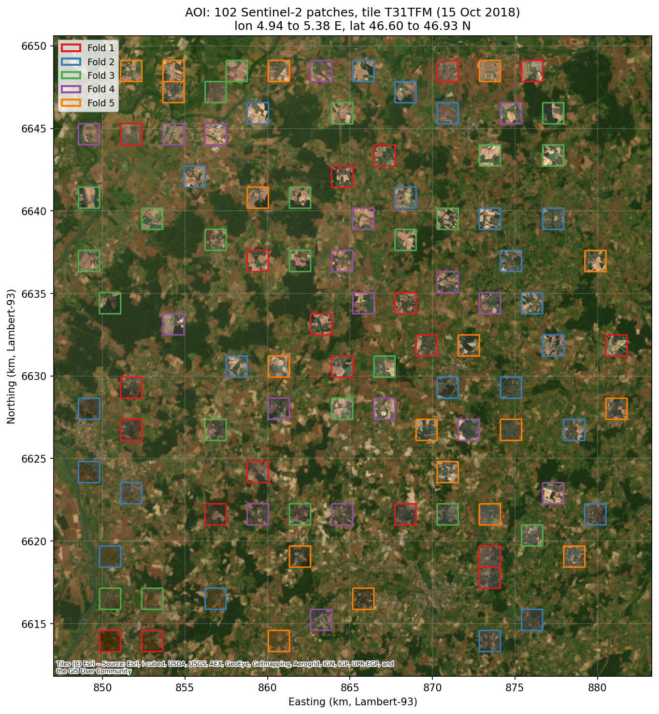
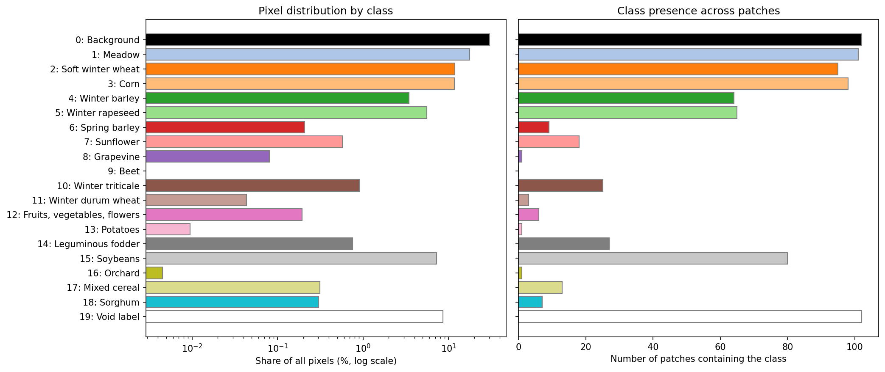
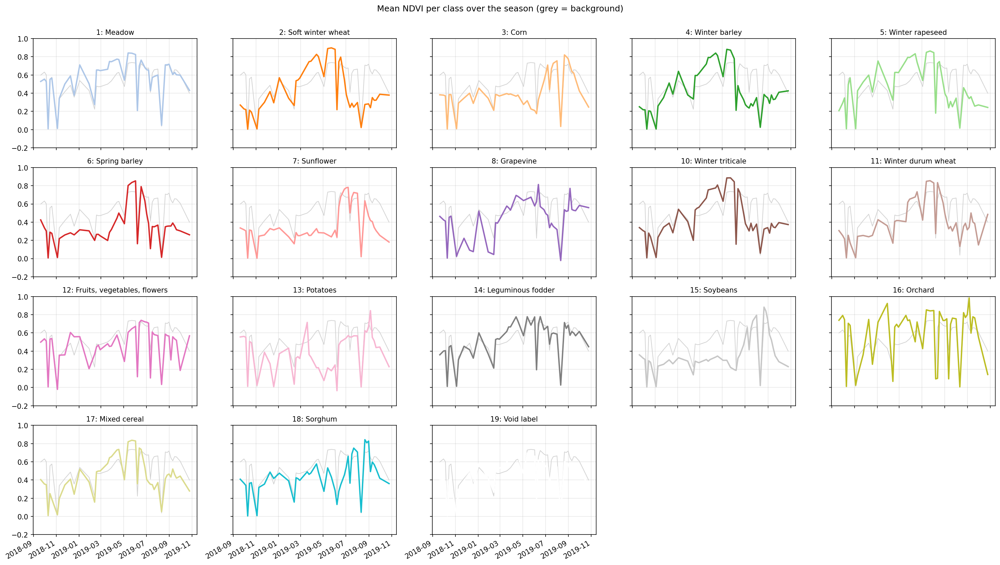
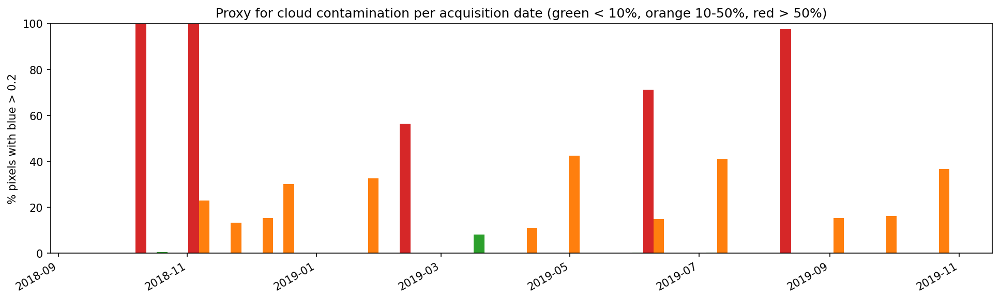
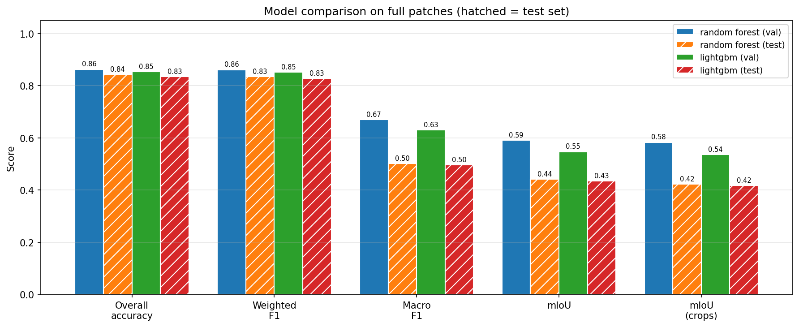
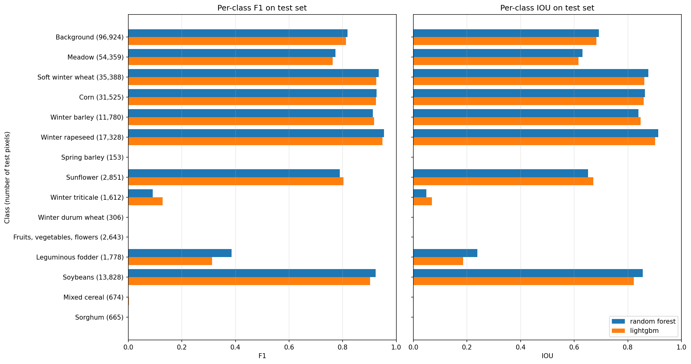
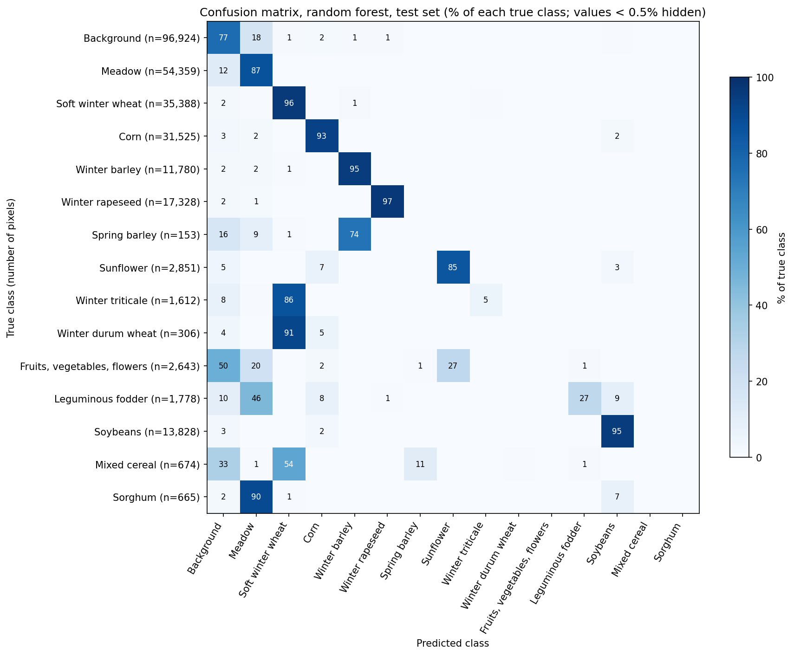
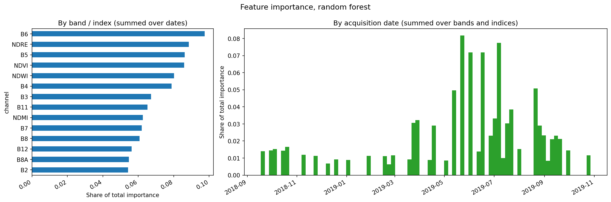

# Crop Type Classification with Multi-Temporal Sentinel-2: Report

## Summary

A pixel-wise Random Forest trained on a full season of Sentinel-2 observations (41 dates × 10 bands + 4 spectral indices) classifies crops in a PASTIS subset from eastern France with **overall accuracy 0.843, weighted F1 0.834, macro F1 0.501 and mIoU 0.441** on a spatially separate test set. The five main field crops (winter rapeseed, soft winter wheat, corn, soybeans, winter barley) are mapped very well, with F1 above 0.9. Performance is limited by rare classes with too few fields to learn from, by cereals with near-identical crop calendars, and by a background class that contains grassland spectrally identical to meadow. The emphasis throughout was on a leakage-free evaluation and on explaining where and why the model fails.

---

## 1. Data and area of interest

The subset contains **102 patches** of 128 × 128 pixels (10 m, about 1.28 × 1.28 km each), all from Sentinel-2 tile **T31TFM**. Every patch has the same **46 acquisitions from 20 September 2018 to 25 October 2019**, covering one full agricultural year. Imagery is `int16` surface reflectance scaled by 10,000; the label layer uses the 20-class PASTIS scheme.

Reprojecting the patch footprints from Lambert-93 (EPSG:2154) to WGS84 places the AOI at roughly **4.94–5.38°E, 46.60–46.93°N**: the Bresse plain in eastern France, east of Chalon-sur-Saône. The labelled classes describe a mixed farming landscape of permanent grassland, winter cereals and rapeseed, and summer crops such as corn and soybeans.

**Class distribution** is highly imbalanced (figure below). Background (30.3% of pixels), meadow (17.7%), soft winter wheat (11.9%), corn (11.8%) and soybeans (7.3%) dominate, while orchard (75 pixels), potatoes (158), durum wheat (725) and grapevine (1,345) are tiny. **Beet does not occur in the subset.** Void labels make up 8.6% of pixels.

**Temporal signatures** differ clearly between crop groups: winter crops green up in spring and senesce by early summer, summer crops peak in July–August, and meadow stays green most of the year. Winter cereals have near-identical NDVI curves, which anticipates the main confusions.

**Clouds are not masked** in PASTIS. Using the share of pixels with blue reflectance above 0.2 as a proxy, five dates are more than half cloudy.

## 2. Approach

### 2.1 Train / validation / test split

The split is by **whole patch and by PASTIS fold**. Neighbouring pixels of one field are near-duplicates, so a random pixel split would put almost identical pixels in training and test and inflate scores. PASTIS folds are spatially separated, so a fold-based split tests generalisation to unseen fields.

All 20 choices of validation and test fold were compared by how many classes each split would lack. The chosen split, **folds 1–3 for training (66 patches), fold 4 for validation (18) and fold 5 for testing (18)**, misses no learnable class in training and keeps the most training patches. Patch IDs are saved in `outputs/splits/`.

### 2.2 Excluded classes

Grapevine, potatoes and orchard each occur in **a single patch**, and beet in none. A single patch cannot be divided between training and test without reintroducing spatial leakage, so these classes could never be evaluated. They are excluded from training and evaluation, like the void label. The model predicts **15 classes**: background and 14 crops.

### 2.3 Preprocessing and features

1. Reflectance clipped to [0, 10,000] and scaled to [0, 1], removing negative artefacts and saturated values.
2. **Five cloudy dates removed** (2018-10-10, 2018-11-04, 2019-02-12, 2019-06-07, 2019-08-11): dates where more than 50% of pixels exceed the blue threshold. The decision uses training patches only. Since all patches share one date axis, the same dates are removed everywhere.
3. Four indices added per date: **NDVI** (greenness), **NDWI** (water), **NDMI** (moisture) and **NDRE** (red edge, chlorophyll).
4. Each pixel becomes one feature vector: 14 channels × 41 dates = **574 features**. The model can therefore learn crop calendars directly.

No standardisation is applied, since tree models are insensitive to feature scale; as a result no statistics are learned from the data during preprocessing.

### 2.4 Sampling strategy

All 102 patches are used. Within each training and validation patch, **up to 150 random pixels per class** are sampled (66,435 training and 19,171 validation pixels). This caps the influence of large classes, spreads samples across many fields instead of thousands of near-identical pixels from a few large ones, and keeps the table small (153 MB). The imbalance falls from roughly 700:1 to 66:1. Evaluation, by contrast, uses **every pixel** of the validation and test patches.

### 2.5 Models and class imbalance

Two tree-based models were trained on the same features:

- **Random Forest** (200 trees, `max_features="sqrt"`, `min_samples_leaf=5`): a robust baseline that needs little tuning and is a standard choice for pixel-based crop mapping.
- **LightGBM** (learning rate 0.05, 31 leaves, at least 50 samples per leaf, 50% feature subsampling), with early stopping on validation macro F1.

Pixel-wise tree models were chosen over a deep network because they suit CPU-only hardware (training takes under a minute on a MacBook Air), are easy to inspect, and match the brief's preference for a well-reasoned baseline.

Remaining imbalance is handled with **sample weights proportional to 1/√(class frequency)**. Fully balanced weights (1/frequency) would weight each durum wheat pixel about 66× more than a background pixel, on only 150 pixels from a few fields, which mostly teaches the model to memorise those fields.

**Early stopping lesson.** LightGBM first used validation log-loss for early stopping and stopped after very few rounds (macro F1 0.607). Training is class-weighted but validation is not, so boosting rare classes makes the probabilities less well calibrated for the validation data: log-loss rose from round 50 onward while F1 was still improving. Stopping on macro F1 instead improved LightGBM to 0.625.

**Model selection.** On validation, the Random Forest scored higher (accuracy 0.850 vs 0.838, macro F1 0.660 vs 0.625 on the sampled table). It was chosen as the final model **before the test set was examined**, and nothing was tuned afterwards.

## 3. Results

### 3.1 Overall scores (all pixels of each patch)

| Model | Split | Overall accuracy | Weighted F1 | Macro F1 | mIoU | mIoU (crops only) |
|---|---|---|---|---|---|---|
| Random Forest | Validation | 0.863 | 0.861 | 0.670 | 0.591 | 0.583 |
| Random Forest | **Test** | **0.843** | **0.834** | **0.501** | **0.441** | **0.423** |
| LightGBM | Validation | 0.854 | 0.852 | 0.630 | 0.547 | 0.536 |
| LightGBM | Test | 0.835 | 0.827 | 0.496 | 0.435 | 0.417 |

Macro F1 and mIoU average over classes present in each split (14 in validation, which has no sorghum; 15 in test). The Random Forest beats LightGBM on every test metric, consistent with the validation-based choice, although the margins are small.

### 3.2 Per-class results (Random Forest, test)

| Class | Precision | Recall | F1 | IoU | Test pixels |
|---|---|---|---|---|---|
| Background | 0.874 | 0.769 | 0.818 | 0.692 | 96,924 |
| Meadow | 0.697 | 0.869 | 0.773 | 0.631 | 54,359 |
| Soft winter wheat | 0.910 | 0.960 | 0.935 | 0.877 | 35,388 |
| Corn | 0.924 | 0.930 | 0.927 | 0.864 | 31,525 |
| Winter barley | 0.876 | 0.953 | 0.913 | 0.839 | 11,780 |
| Winter rapeseed | 0.943 | 0.966 | **0.955** | 0.913 | 17,328 |
| Spring barley | 0.000 | 0.000 | 0.000 | 0.000 | 153 |
| Sunflower | 0.733 | 0.853 | 0.789 | 0.651 | 2,851 |
| Winter triticale | 0.305 | 0.054 | 0.092 | 0.048 | 1,612 |
| Winter durum wheat | 0.000 | 0.000 | 0.000 | 0.000 | 306 |
| Fruits, vegetables, flowers | 0.000 | 0.000 | 0.000 | 0.000 | 2,643 |
| Leguminous fodder | 0.677 | 0.270 | 0.386 | 0.239 | 1,778 |
| Soybeans | 0.897 | 0.950 | 0.923 | 0.857 | 13,828 |
| Mixed cereal | 0.000 | 0.000 | 0.000 | 0.000 | 674 |
| Sorghum | 0.000 | 0.000 | 0.000 | 0.000 | 665 |

### 3.3 Confusions

| True class | Main confusion | Share of true class |
|---|---|---|
| Background | Meadow | 17.9% |
| Meadow | Background | 11.7% |
| Winter durum wheat | Soft winter wheat | 91% |
| Sorghum | Meadow | 90% |
| Winter triticale | Soft winter wheat | 86.5% |
| Spring barley | Winter barley | 74% |
| Mixed cereal | Soft winter wheat (54%), background (33%) | — |
| Fruits, vegetables, flowers | Background | about 50% |

### 3.4 Example predictions

Test patches are shown from best to worst pixel accuracy (93.5% to 67.0%), chosen by rank rather than hand-picked. The RGB uses the clearest summer date.

### 3.5 Feature importance

## 4. Analysis and interpretation

### Why this model

A pixel-wise Random Forest on temporal features is simple, fast on a CPU, robust with little tuning and interpretable through feature importance. It uses the most informative signal in this problem, the crop calendar, without needing a GPU. It beat LightGBM here because boosting repeatedly focuses on the hardest pixels, many of which belong to rare classes from a handful of fields, so it quickly learns field-specific details that do not transfer to the spatially separate validation fold. Bagging averages over many independent trees and is more robust with few independent samples.

### What works well

The **major field crops reach F1 above 0.9**: rapeseed 0.955, soft wheat 0.935, corn 0.927, soybeans 0.923, winter barley 0.913. They have ample training data and distinctive calendars: rapeseed flowers in April, winter cereals are green through spring and harvested by July, and corn and soybeans only green up in summer. Overall accuracy drops just 2 points from validation to test, so the model generalises to new areas for the classes that cover most of the land.

**Feature importance matches agronomic expectations.** Red-edge information ranks highest (B6, NDRE, B5), consistent with its sensitivity to chlorophyll content and canopy structure. The most informative dates fall between **mid-May and early July**, when winter cereals ripen while summer crops emerge, with secondary peaks in spring and late August. Autumn and winter dates matter little, since most fields are bare or uniform then. Random Forest importance is spread unevenly across correlated features, so these patterns should be read qualitatively.

### What works poorly, and why

**1. Background ↔ meadow (the largest error by pixel count).** In PASTIS, background means any land not declared as an agricultural parcel, which includes unregistered grassland, road verges and hedgerows. These are spectrally the same as meadow, so reflectance cannot separate them. This is mainly a **label-definition issue** rather than a model failure, and it is the main reason meadow's precision is only 0.70. It dominates the worst test patch, a landscape of small hedged fields.

**2. Rare classes are absorbed by their most similar common class.** Durum wheat and triticale are predicted as soft wheat, spring barley as winter barley, and mixed cereal as soft wheat. These are cereals with nearly the same growth cycle at 10 m resolution, and the rare ones have very few training fields. When the model is uncertain between a rare class and a similar common one, predicting the common one is right far more often in training, which is classic behaviour under imbalance.

**3. Sorghum is predicted as meadow (90%).** A plausible explanation is that sorghum here is largely grown as a forage crop: sown late, often after a cover crop or temporary grassland, and cut more than once, giving a long green profile resembling meadow rather than the single summer peak of grain crops. With only about 900 training pixels and no validation pixels, this could not be detected before testing. This is a hypothesis; no management data was available to confirm it.

**4. Fruits, vegetables and flowers are predicted as background.** This is a heterogeneous class of different plants, usually grown in small plots. At 10 m, many pixels mix crop, paths and bare soil.

### Effects of the data

- **Class imbalance and limited samples.** Five test classes score zero, and they alone pull macro F1 from 0.67 (validation) to 0.50 (test). Macro F1 weights every class equally, so a few tiny classes dominate it; weighted F1 (0.83) better reflects mapped area.
- **Unstable rare-class scores.** With one or two fields per class and fold, a single field decides the score: triticale is 59% correct on validation but 5% on test, spring barley 81% versus 0%. Rare-class results should be read with this in mind.
- **Label quality.** The background definition creates unavoidable confusion with grassland. Void pixels (parcel borders and uncertain parcels) were excluded, which removes the hardest boundary pixels from scoring, so reported scores are slightly optimistic compared with a wall-to-wall map.
- **Spatial resolution.** Error maps show thin error lines along field edges, where 10 m pixels mix two fields. Small or narrow parcels are affected most.
- **Clouds and missing observations.** Five fully cloudy dates were removed; partial clouds and shadows in remaining dates are left in as noise. Removing dates in early June and mid-August creates small gaps in key periods, though neighbouring dates remain.
- **Seasonal timing.** The season from September to October captures both winter and summer crop cycles, but crops sown after a previous harvest (double cropping) or cut repeatedly (forage) do not follow a single standard calendar.
- **Pixel independence.** Each pixel is classified on its own, which causes speckle within fields.

### Assumptions

- Reflectance values follow the Sentinel-2 L2A convention (scale factor 10,000, no offset).
- Dates in `metadata.geojson` are in the same order as the observation axis of the arrays; this was verified by count for every patch.
- The PASTIS folds are spatially independent enough for evaluation; the AOI map shows folds interleaved across one region, so the test estimates performance **within this region only**.
- A date counts as cloudy if more than 50% of pixels have blue reflectance above 0.2; this simple proxy may miss thin cloud and shadows.

## 5. Recommended next steps

1. **Parcel-level classification.** Aggregate pixel predictions within each parcel (majority vote) or classify parcels using averaged time series. This removes speckle and edge errors and matches how crop statistics are usually reported.
2. **Merge classes that cannot be separated at this resolution**, for example a single wheat class (soft and durum) or a cereals group, or use a hierarchical scheme: crop group first, then species where the signal allows.
3. **More data for rare classes**: the full PASTIS dataset (2,433 patches across four tiles) or other years and regions, which would also test transfer beyond one tile.
4. **Better cloud handling**: a cloud mask (for example Sentinel-2 SCL or s2cloudless), then temporal interpolation to regular dates instead of dropping whole dates.
5. **Temporal deep learning**: models designed for satellite image time series, such as U-TAE (the PASTIS benchmark model), L-TAE or a TempCNN, which learn temporal patterns and spatial context jointly.
6. **Cross-validation over all five folds** to report mean and variance of scores, which is especially important for rare classes.
7. **Threshold or cost tuning** on validation to trade precision for recall on classes of interest.

## References

- Garnot, V. S. F., & Landrieu, L. (2021). Panoptic Segmentation of Satellite Image Time Series with Convolutional Temporal Attention Networks. *ICCV 2021*. Dataset: https://github.com/VSainteuf/pastis-benchmark